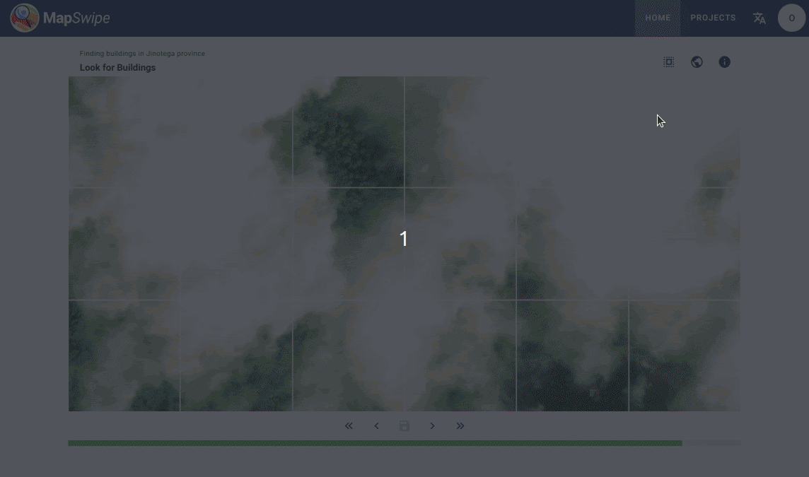

[MapSwipe4Web](https://web.mapswipe.org) launched officially at [State of the Map US 2024](https://openstreetmap.us/events/state-of-the-map-us/2024/), in Salt Lake City, Utah on Friday, June 7th at 2:15PM local time in a Birds of a Feather session. Participants took a test drive of the brand new product and had a discussion of how it could be used for humanitarian purposes. Presentation slides [here](https://slides.com/nicolelaine/2024-sotm-us-mapswipe4web-launch-party).

This was a very exciting tool to project manage and I'm thrilled that it's now out here in the world for all to use.

MapSwipe4Web lets mappers use a much bigger screen, can be used for experimental project types, and you can do it all directly from your browser.

<figure>
  
  <figcaption style="text-align: center;">
    A gif showing how to mark multiple times at once as bad imagery in MapSwipe4Web. Created by Raiza Pilatowsky Gruner.
  </figcaption>
</figure>

<figure>
  <video controls style="max-height: 500px; width: 200%; height: auto;">
    <source src="ms-insta-reel.mp4" type="video/mp4">
    Your browser does not support the video tag.
  </video>
  <figcaption style="text-align: center;">
    A video created by Raiza Pilatowsky Gruner for HOT's instagram, celebrating the launch of MapSwipe4Web. 
  </figcaption>
</figure>

